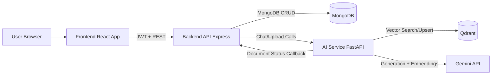

# Legal Helper

Production-grade AI legal assistant platform with a 3-service architecture:

1. React frontend (Vite + Tailwind + Redux Toolkit)
2. Node.js backend API (Express + MongoDB + JWT)
3. Python AI service (FastAPI + Gemini + Qdrant)

## Architecture Diagram



## Folder Structure

```txt
Project/
  backend/
    src/
      config/
      controllers/
      middleware/
      models/
      routes/
      services/
      utils/
      app.js
      server.js
    uploads/
    logs/
  ai-service/
    app/
      api/
      core/
      schemas/
      services/
      utils/
      main.py
    requirements.txt
  frontend/
    src/
      app/
      components/
      features/
      pages/
      services/
      styles/
  docker-compose.yml
  README.md
```

## Implemented Features

### Auth

- `POST /api/auth/signup`
- `POST /api/auth/login`
- `POST /api/auth/refresh`
- bcrypt password hashing
- Access + refresh token flow
- Protected route middleware
- Basic session tracking in `users.sessions`

### User

- `GET /api/user`
- `PUT /api/user`
- `DELETE /api/user`

### Chat

- `POST /api/chat`
- `GET /api/chat`
- `GET /api/chat/:id`
- `POST /api/chat/:id/message`
- Message edit/resend via `editMessageId` in message payload
- Citation persistence on assistant messages
- Token usage logging in `tokenusages` collection

### Documents

- `POST /api/documents/upload`
- `GET /api/documents`
- `GET /api/documents/:id/status`
- `POST /api/documents/:id/retry`
- Internal callback endpoint: `POST /api/documents/internal/status`
- Status lifecycle: `pending -> processing -> completed/failed`
- Idempotency via `(userId, checksum)` unique index

### AI Service

- `POST /upload` starts FastAPI `BackgroundTasks` processing
- `POST /chat/stream` for streaming RAG chat
- `POST /pdf/chat` for file-specific contextual chat
- Qdrant top-k retrieval with citation payloads
- Gemini generation + embeddings (fallback behavior if key is missing)

## Environment Setup

### 1. Backend

1. Copy `backend/.env.example` to `backend/.env`
2. Fill secrets and URLs
3. Install and run:

```bash
cd backend
npm install
npm run dev
```

### 2. AI Service

1. Copy `ai-service/.env.example` to `ai-service/.env`
2. Set `GEMINI_API_KEY`, `QDRANT_URL`, `BACKEND_URL`, `INTERNAL_API_KEY`
3. Install and run:

```bash
cd ai-service
python -m venv .venv
# Windows PowerShell:
.\.venv\Scripts\Activate.ps1
pip install -r requirements.txt
uvicorn app.main:app --reload --port 8000
```

### 3. Frontend

1. Copy `frontend/.env.example` to `frontend/.env`
2. Install and run:

```bash
cd frontend
npm install
npm run dev
```

### 4. Databases

Run MongoDB and Qdrant locally (or via Docker below).

## Docker Setup (Preferred)

1. Create env files from examples:

- `backend/.env`
- `ai-service/.env`
- `frontend/.env`

2. Start all services:

```bash
docker compose up --build
```

3. Access:

- Frontend: `http://localhost:5173`
- Backend: `http://localhost:4000/health`
- AI Service: `http://localhost:8000/health`
- MongoDB: `localhost:27017`
- Qdrant: `http://localhost:6333`

## API Contracts

### Chat Message Payload

```json
{
	"content": "What are termination clauses in SaaS agreements?",
	"fileId": "optional-document-id",
	"editMessageId": "optional-message-id"
}
```

### AI Chat Response

```json
{
	"answer": "...",
	"citations": [
		{
			"documentId": "...",
			"chunkId": "...",
			"text": "...",
			"score": 0.91
		}
	],
	"tokenUsage": {
		"inputTokens": 120,
		"outputTokens": 220,
		"totalTokens": 340
	}
}
```

## Engineering Notes

- Structured modular code layout for each service
- Input validation with Joi on backend
- Centralized error handling and logging
- Basic rate limiting enabled
- Environment-based configuration
- Clear separation between API orchestration and AI/RAG processing

## Build Order Followed

1. Backend auth + Mongo schemas
2. Frontend basic UI + auth
3. Chat system baseline
4. AI service LLM call
5. RAG integration with Qdrant
6. Background ingestion pipeline
7. Document UI + status tracking + retry
8. Production hardening (logging, validation, rate limit, env config)
